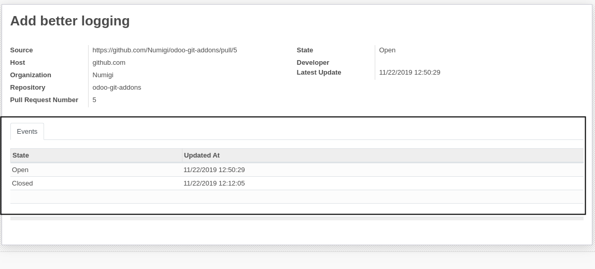
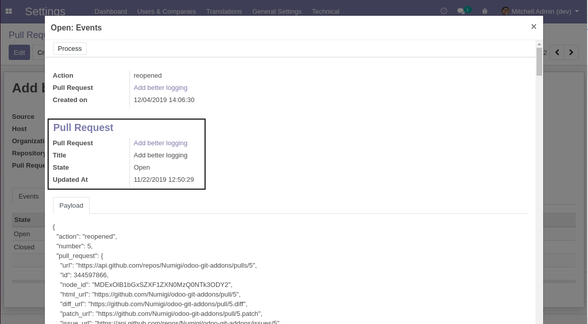
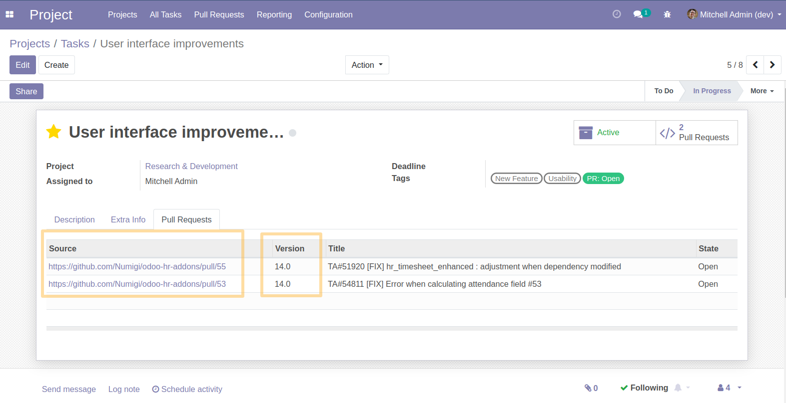
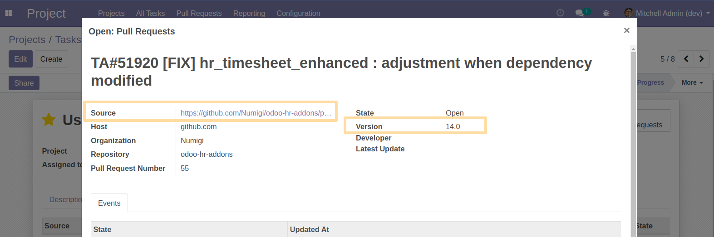
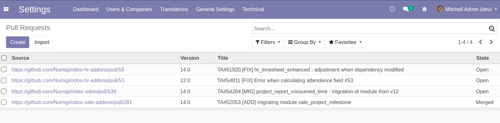

Github Pull Request
===================

This modules defines what is a GitHub pull requests (as an Odoo object).

.. contents:: Table of Contents

Pull Requests
-------------
As system administrator, I go to ``Configuration > Technical > GitHub > Pull Requests``.

 .. image:: static/description/menu_technical_pull_requests.png

I see the list of pull requests:

 .. image:: static/description/pull_request_tree.png

 .. image:: static/description/pull_request_form.png

Events
------
A pull request has a list of events.

In the form view of an event, a ``Pull Request`` section is added.

This section is filled using the payload when processing the event.

Pull Request Creation / Update
------------------------------
When an event is processed, a pull request is assigned to the event.
If no existing pull request matches the event, a new pull request is created.

..

    Of course, if the event is not related to a pull requests (i.e. if it was generated from a github issue),
    no pull request will be assigned to it.

If it is the latest event for the pull request, the pull request record
will be updated from the event data.

Therefore, a pull request record in Odoo is updated as soon has new events are registered.

Release
-------
Since the version 1.0.1 of this module here are the new features:

* Addition of Branch information
As a project user on Konvergo, I click on the task concerned, then on the Pull request tab. 
I see now a new Branch field, which allows me to know which is the target branch of the pull request.

By making a pull request, Konvergo automatically detects the branch from GitHub.

* Clickable source link
The source field value is now clickable to redirect to the pull request on github.

In `Settings > Github > Pull Requests`, list view has now the column ``version``:

Contributors
------------
* Numigi (tm) and all its contributors (https://bit.ly/numigiens)
