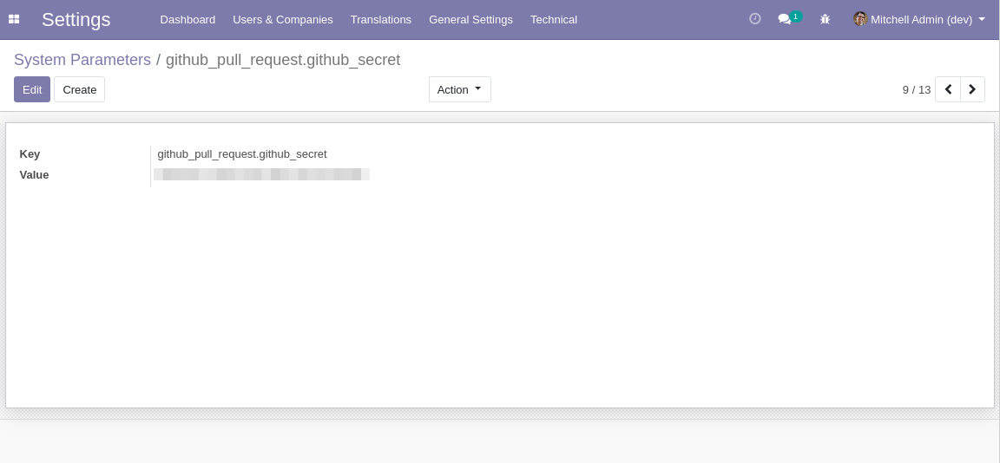
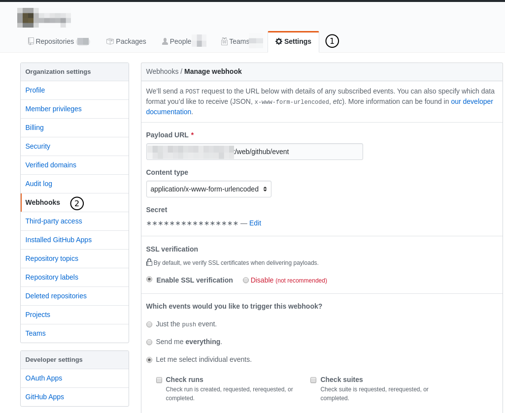

Github Pull Request
===================

This modules defines GitHub pull requests and events.

.. contents:: Table of Contents

Pull Requests
-------------
As system administrator, I go to ``Configuration > Technical > GitHub > Pull Requests``.

 .. image:: static/description/menu_technical_pull_requests.png

I see the list of pull requests:

 .. image:: static/description/pull_request_tree.png

 .. image:: static/description/pull_request_form.png

Events
------
As system administrator, I go to ``Configuration > Technical > GitHub > Events``.

 .. image:: static/description/menu_technical_events.png

I see the list of events:

 .. image:: static/description/event_tree.png

 .. image:: static/description/event_form.png

Github Webhook
--------------
The module contains an HTTP controller to register events in Odoo using github webhook.

Each event is processed asynchronously in a queue job.

Configuration
~~~~~~~~~~~~~
First, generate a secret that will be used to authentify the webhook with your Odoo instance.
You may use the tool of your choice to create the secret.

Then, create a system parameter:

* Key: ``github_pull_request.github_secret``
* Value: Your secret

Then, in Github, setup the webhook.

* Payload URL: ``{base_url}/web/github/event``
* Content Type: ``application/x-www-form-urlencoded``
* Secret: Your secret

In the section ``Which events would you like to trigger this webhook?``,
select ``Let me select individual events``, then check ``Pull requests``.

Contributors
------------
* Numigi (tm) and all its contributors (https://bit.ly/numigiens)
