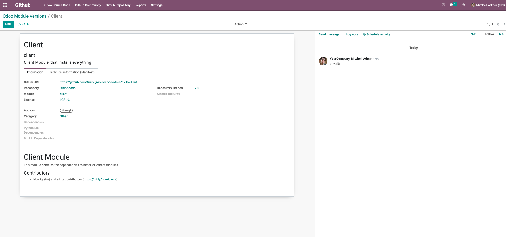

Numistore
=========
This module sets up a place to discover and discuss odoo modules.

It is based on the store developed by OCA.

Settings
--------

Need to setup the `[options] github_token` in odoo.conf file.
See https://github.com/settings/tokens to generate your GitHub token.

Specifics
---------
Numigi doesn't use the store as it was thought initially by OCA. We want to use it
as a knowledge base.

To help to share and discuss, we then customize the solution with this purpose in mind.

Chatter on odoo.module.version
~~~~~~~~~~~~~~~~~~~~~~~~~~~~~~

Contributors
------------

The `Numigi <https://numigi.com/r/home>`_ team is the contributor to this project. We help Quebec companies implement Odoo and Konvergo ERP.
